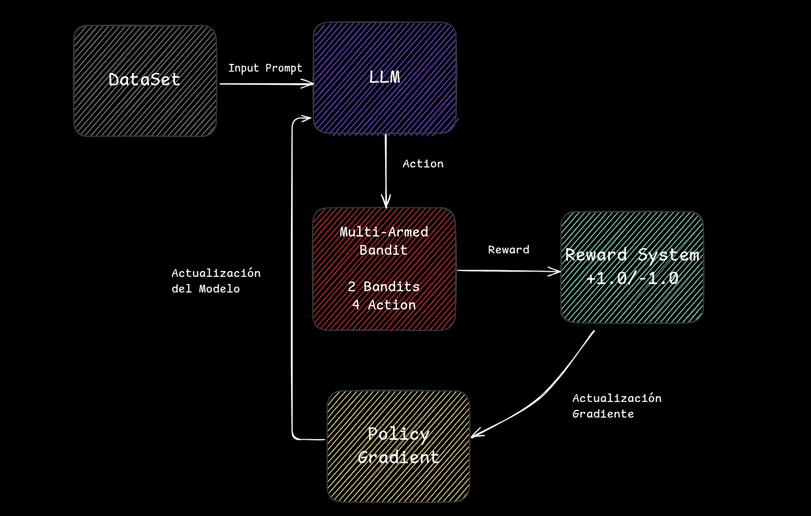
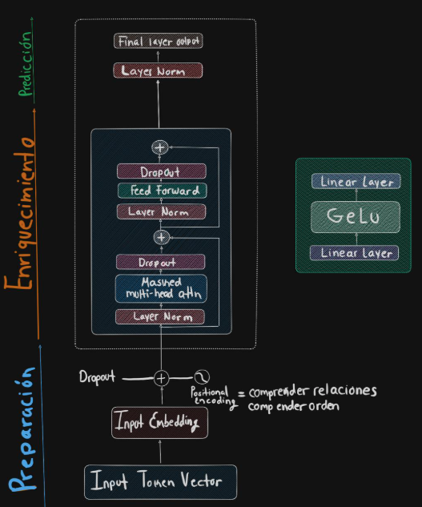
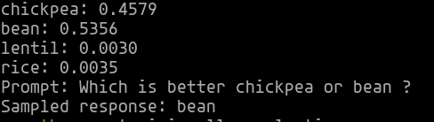
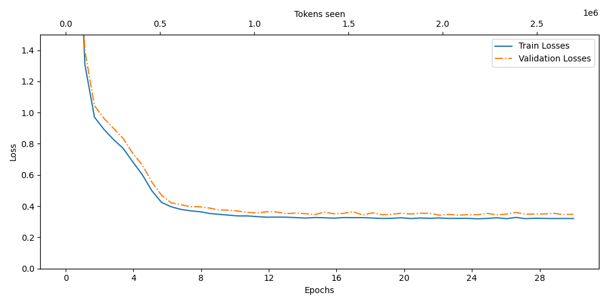
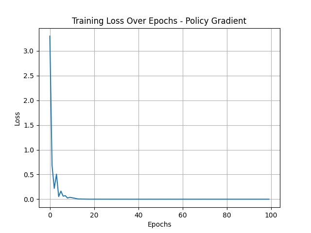
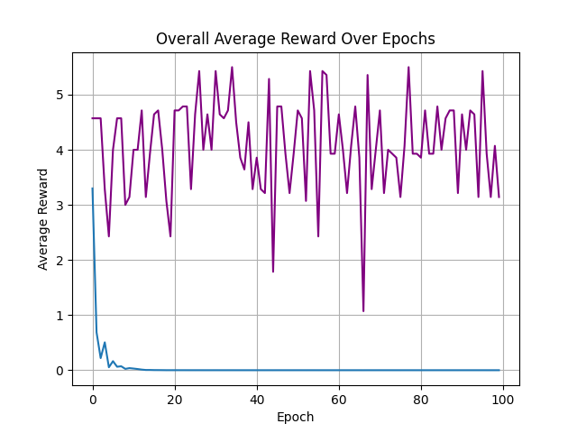
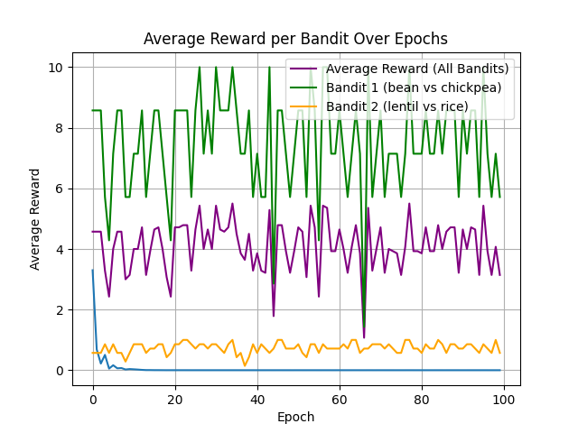
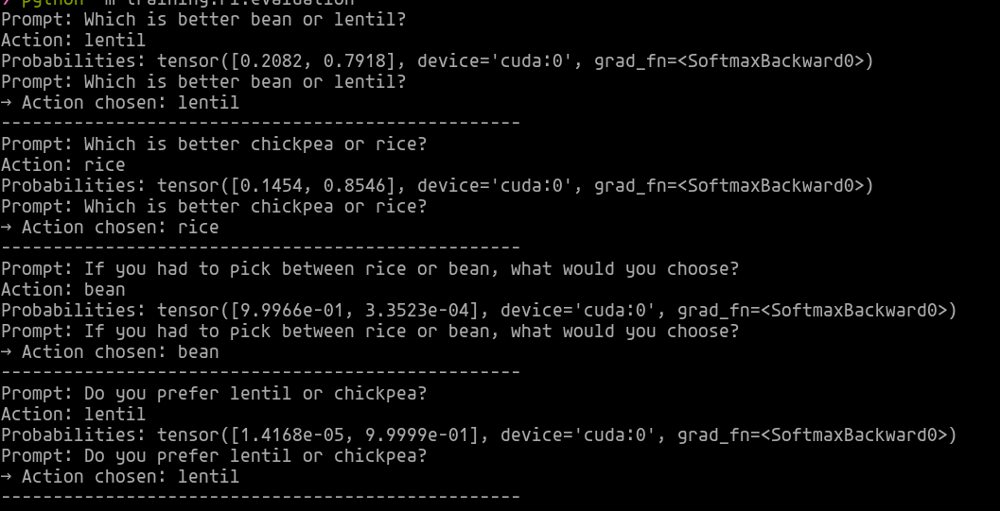

# LLM Context Dependence with Reinforcement Learning

**Autor:** Miguel Angel Cabrera Victoria

**Insititucion :** Insitituto Tecnologico y de Estudios Superiores De Monterrey

**Email:** A01782982@tec.com.mx | miguelangelcabreravictoria@gmail.com

**Fecha :** 29 de Mayo del 2025

## Indice 

1. [Descripción del Proyecto](#descripción-del-proyecto)  
2. [Arquitectura General](#arquitectura-general)  
3. [Fundamentos Teóricos](#fundamentos-teóricos)  
   3.1 [REINFORCE y Policy Gradient](#reinforce-y-policy-gradient)  
   3.2 [Modelos de Lenguaje (LLM)](#modelos-de-lenguaje-llm)  
4. [Metodologia](#metodologia)
5. [Entrenamiento y Resultados](#entrenamiento-y-resultados)  
6. [Ejecución del Proyecto](#ejecución-del-proyecto)  

## Descripción del Proyecto

Este trabajo explora la aplicación de técnicas de Aprendizaje por Refuerzo (Reinforcement Learning, RL), específicamente el método de gradiente de políticas (Policy Gradient), en un entorno simplificado de multi-armed bandit utilizando **modelos de lenguaje (LLMs)** como función de política.

El núcleo del enfoque consiste en emplear un modelo **nanoGPT** para seleccionar entre múltiples opciones, en un escenario compuesto por dos bandits que otorgan recompensas de manera arbitraria. Cada bandit presenta dos acciones posibles, cuyas recompensas se asignan de forma estocástica, simulando así un entorno clásico de RL con incertidumbre. A diferencia de las tareas tradicionales de procesamiento de lenguaje natural (NLP), el modelo no busca predecir la salida correcta, sino tomar decisiones coherentes condicionadas al prompt recibido. La salida del sistema se restringe a un conjunto cerrado de cuatro palabras, y el modelo recibe una recompensa en función de la acción seleccionada.

El entrenamiento se lleva a cabo mediante el algoritmo **REINFORCE**, que estima el gradiente de la política y actualiza los parámetros del modelo en función de la recompensa observada.

El objetivo principal es analizar el comportamiento de la política cuando se cruzan los contextos entre los dos bandits, con el fin de evaluar si el modelo desarrolla preferencias generalizables o bien específicas a los prompts presentados.

## Arquitectura General

**Componentes:**

- `nanoGPTModel`: modelo base de lenguaje
- `Agent`: clase que conecta el modelo con la política
- `allowed_words`: vocabulario restringido para decidir acciones
- `prompt`: entrada textual
- `logits`: salida del modelo para sampling
- `policy_loss`: función de pérdida basada en REINFORCE
## Fundamentos Teóricos
### REINFORCE y Policy Gradient

El algoritmo **REINFORCE** es un método de la familia de Policy Gradient utilizado en Reinforcement Learning (RL) para optimizar directamente una política parametrizada. Durante la fase de entrenamiento, la política se actualiza en función de las acciones ejecutadas, ajustando las probabilidades de selección de cada acción en cada estado según las recompensas acumuladas. De este modo, las acciones que generan mayores recompensas se refuerzan, mientras que aquellas que aportan poco o ningún valor ven disminuida su probabilidad de ser elegidas.

En este trabajo, la política está parametrizada mediante una red neuronal, específicamente un nanoGPT, cuya función es mapear el contexto del prompt hacia una distribución de probabilidad sobre las acciones posibles. El objetivo principal es maximizar la recompensa esperada, permitiendo que la política aprenda progresivamente a seleccionar las acciones más favorables en función del entorno y del historial de recompensas.
$$
J(\theta) = \mathbb{E}_{\tau \sim \pi_\theta} \left[ \sum_{t=0}^{T} R(\tau) \right]
$$

- $\theta$: son los parámetros de la política.

- $\tau$: es una trayectoria (secuencia de estados, acciones y recompensas).

- $R(\tau)$: es la recompensa total obtenida en la trayectoria.

Para actualizar los parámetros de la política, utilizamos el gradiente de la función objetivo, dado por:
$$
\nabla_{\theta} J(\theta) = \mathbb{E}_{\tau \sim \pi_\theta} \left[ \sum_{t=0}^{T} \nabla_{\theta} \log \pi_\theta(a_t | s_t) \cdot R_t \right]
$$

- Estado ($s_t$): corresponde al prompt o contexto de entrada en el tiempo

- Acción ($a_t$): palabra seleccionada del vocabulario por el modelo.

- Política ($\pi_\theta$): predicción de la distribución de probabilidad sobre las palabras, generada por el nanoGPT.

- Recompensa ($R_t$): alor de recompensa observado al ejecutar la acción $a_t$.

> En práctica, ya que si se minimiza el loss se maximiza el reward
    
        loss = -log_prob * reward

- Si la accion es buena, loss es negativo, así que al minimizar loss se aumenta la probabilidad de la acciíon

- Si la acción mala, loss es positiva, así que al minimizar, se disminuye la probabilidad de esa acción.

De esta manera, la política aprende progresivamente a reforzar acciones que maximizan la recompensa esperada y a desalentar aquellas que no aportan valor, siguiendo el principio fundamental del algoritmo REINFORCE.

    
### Modelos de Lenguaje (LLM)

El **Generative Pre-trained Transformer** (GPT) es un modelo de inteligencia artificial generativa cuya función principal es producir texto coherente, contextual y semánticamente significativo a partir de un prompt de entrada.

Su arquitectura se basa en la estructura de redes neuronales denominada **Transformer**, que permite procesar y representar secuencias de texto mediante mecanismos de atención (attention mechanisms). Gracias a ello, el modelo es capaz de capturar relaciones complejas entre palabras y frases, manteniendo la consistencia y el sentido del contexto a lo largo del texto generado.

  

> Configuracion nanoGPT (./config/llm.yml)

    Tamaño Embedding: 192
    Numero de Cabeceras: 8
    Numero de Capas: 8
    Dropout: 0.3
    Tasa de aprendizajes (a): 0.0004
   

> Configuracion Estandard GPT2

    Tamaño Embedding: 768
    Numero de Cabeceras: 12
    Number de Capas: 12

## Metodología 

### Fase 1: Desarrollo y Configución de la Arquitectura GPT

#### 1.1 Diseño de Arquitectura Base

Se comenzó implementando una arquitectura base inspirada en GPT-2, pero reducida y adaptada para fines experimentales, enfocada específicamente en el problema de multi-armed bandit. La idea central era tratar cada paso de interacción con el entorno como parte de una secuencia que puede ser modelada con un Transformer autoregresivo. Para la tokenización se utilizó Tiktoken de OpenAI, ya que cuenta con un vocabulario de 50,257 tokens, lo cual permite codificar eficazmente las secuencias de acción y recompensa. El modelo fue entrenado utilizando una estrategia sliding window, propia de los GPT, donde el input era una ventana de contexto formada por pares de acción-recompensa anteriores con el objetivo de predecir la siguiente acción. Esta formulación convierte el problema en una especie de autocompletado inteligente, pero en lugar de predecir palabras, se predicen decisiones óptimas. 

#### 1.2 Diseño del Dataset para Multi-Armed Bandit

Se desarrollo un script especializado para generar un dataset balancedo que permita al modelo aprender las 4 opciones de muestreo requeridas, para ello se creaon preguntas directas de comparación, de preferencias y con contexto de decisión forzada.

#### 1.3 Configuraciones apropiadas al problema

Se exploraron distintas configuraciones para mejorar el desempeño. En particular, se probaron variantes del bloque de antención multi-cabeza, comenzando con 2 y escalando hasta 8 cabezas, con el objetivo de capturar relaciones dentro de las secuencias. Asimismo, se experimento con redes Feed-Forward de entre 2 y 6 capas, ajustando el número de redes neuranales por capa para encontrar un equilibrio de generalizacion, almacenandolos en checkpoints.

### Fase 2 Validacion y Evaluacion Inicial

Para la validación de las distribuciones de probabilidad, se extrajeron los checkpoints entrenados del modelo, con el objetivo de evaluar su desempeño utilizando un conjunto de prompts de prueba. Este procedimiento permitió realizar un análisis detallado de las distribuciones de probabilidad generadas, asegurando que la normalización fuera correcta y consistente, y verificando que el modelo asignara probabilidades coherentes a las posibles acciones en función del contexto proporcionado.

$$
P(bean) + P(chickpea) \approx 0.5,P(lentil)+P(rice)
\approx0.5
\\
\sum P(options) \approx 1.0
$$

### Fase 3 Implementacion Agente + Policy Gradient

### 3.1 Implementacion del agente y 

Se procedió a la implementación del agente de Reinforcement Learning, encapsulando la interacción entre el nanoGPT y el entorno de multi-armed bandit como una política parametrizada.

El agente utiliza un tokenizador para procesar los prompts de entrada y generar distribuciones de probabilidad sobre un conjunto limitado de palabras permitidas. A partir de los logits producidos por el modelo, se aplica una función Softmax para obtener una distribución de probabilidad válida, a partir de la cual se selecciona una acción mediante muestreo estocástico.

El entorno de bandit se definió con dos recompensas base:

- Primer bandit: recompensa base de 10.0

- Segundo bandit: recompensa base de 1.0

Para simular la aleatoriedad de las recompensas, se definieron probabilidades condicionales según la acción elegida:

- Primera opción: 75% de probabilidad de recibir la recompensa base

- Segunda opción: 25% de probabilidad de recibir la recompensa base

Esta configuración permite evaluar cómo el agente aprende a maximizar la recompensa esperada mediante el algoritmo REINFORCE, reforzando acciones que generan mayores recompensas y disminuyendo la probabilidad de acciones subóptimas, en un entorno estocástico y parcialmente observable.

Se aplico el algoritmo REINFORCE utilizando una función de perdida que dado al multiplicarlo por el logaritmo de la probabilidad de la acción elegida por la recompensa obtenida, permite actualizar la politica directamente.

Se entrenó el modelo durante 100 épocas, alternando entre prompts diseñado especifiacamente para cada bandit. La optimización se realizo usando el optimizador AdamW, con el fin de ajistar los pesos internos del modelo nanoGPT para aumentar la probabilidad de seleccionar las palabras correactas según la recompensa obtenida.

[Samples](https://docs.google.com/document/d/1j7y4r6akjcRMueafs06NStS-gdQ-TJ8G3apVdF9W6wA/edit?usp=sharing)

### Limitaciones

- Entrenamiento de políticas con Feedback Humano (RLHF)
- Necesidad de fine-tuning especifico
- DataSet Extenso (5 GB)
- Dependencia del Prompt

## Entrenamiento y Resultados

### Resultados de Validacion 

### Entrenamiento nanoGPT

Se oberva que aun con un numero razonable de cabezeras y capas el modelo tiende a sobreajustar rápidamanete, a pesar de ello, el modelo mostró una aprendizaje estable y una capacidad razonable para generalizar.

### Entrenamiento Policy Gradient

Se peude observar que el agente aprende a seleccionar consistentemente la opcion óptima para cada prompt, reflejando en las altas probabilidades asigandas a la acción correcta en cada contexto. Las gráficas muestran una disminucion progresiva de la funciíon de perdida y un aumento en el reward promedio, indicando que la politica se ajusta de manera correcta para maximizar la recompensa esperada.

El agente aprende a maximizar la recompensa en cada contexto, alcanzando valores altos y estables para Bandit 1 y valores bajos para Bandit 2, reflejando la diferencia en las recompesas base.

### Validacion al cruzar contextos

## Ejecución del Proyecto

> Estructuctura de Archivos

    |- config
        >llm.yml
    |- data
        >context.txt
    |- models
        |- llm
            |- attention
                >MultiHeadAttention.py
            |- dataloader
                >dataloader.py
                >dataset.py
            |- model
                >feedForward.py
                >gpt_mode.py
        |- rl
            > agent.py
    |- scripts
       >make_training_data.py
       >train_LLM.sh
    |- training
        |- llm
            > constant_trainining.py
            >evaluation.py
            >plotting.py
            >train_loop.py
        |- rl
            >training.py
    |- utils
        >config_loader.py

### Requisitos

    Python 3
    CUDA version 12.2+
    PyTorch
    Tiktoken
    Conda

### Instalacion y Uso

    git clone git@github.com:MiguelCabreraVictoria/research.git
    cd research
    ./scripts/train_LLM.sh
    ./scripts/train_RL.sh

